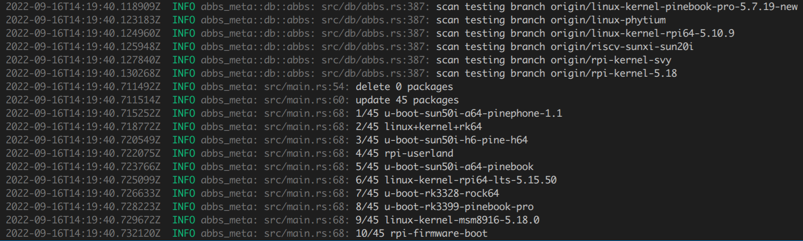

# abbs-meta

# 背景

本项目是开源之夏课题 [AOSC 的软件包信息站重实现](https://summer-ospp.ac.cn/#/org/prodetail/22f3e0080) 的具体实现。

本项目是[旧的数据同步后端](https://github.com/AOSC-Dev/abbs-meta)的 Rust 重实现，其目标是从 ABBS tree 生成 `packages-site` 所需的 PostgreSQL 数据库。

# 功能

- 支持增量更新（基于 git2-rs）
- 高性能，使用 `rayon` 尽可能地并行程序逻辑，初次扫描只需花费 3 分钟（原实现大约需要 4-5 小时）
- 相较于以往的旧实现，新增了更多的表与字段，大大减少了增量数据库的大小
- 能扫描并记录软件包错误
- 能扫描测试分支，并追踪 1000 个 commit 内发生的修改
- 使用 `toml` 来表示配置文件，比命令行参数更直观

# 编译

```bash
# install Rust toolchain
curl --proto '=https' --tlsv1.2 -sSf https://sh.rustup.rs | sh

# install dependencies
sudo apt install clang make pkg-config

# build
cargo build --release
```

# 运行

 你可以参照 config.toml 里的内容进行配置，这里以 config.toml 的配置作为例子。

```bash
# clone aosc-os-abbs
git clone https://github.com/AOSC-Dev/aosc-os-abbs.git /tmp/aosc-os-abbs
# clone aosc-os-bsps
git clone https://github.com/AOSC-Dev/aosc-os-bsps.git /tmp/aosc-os-bsps

# run abbs-meta
cargo run --release
```

**注意**：如果要生成可供 `packages-site` 使用的数据库，你还需要运行 [`dpkgrepo-meta`](https://github.com/AOSC-Dev/dpkgrepo-meta) 以便生成与 dpkg 相关的表。

# 运行截图


